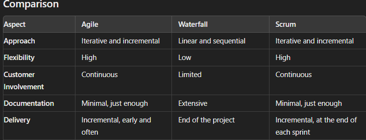

# SE-Assignment-7
Assignment: Software Project Management
Instructions:
Answer the following questions based on your understanding of software project management. Provide detailed explanations and examples where appropriate.

 Questions:

1. Definition and Importance of Software Project Management:
   - What is software project management, and why is it crucial in the context of software development projects?

    Software project management is the process of planning, organizing, leading, and controlling a software development team to achieve all goals within given constraints for a software project.

    Software Project Management is crucial because it ensures that resources are allocated and used efficiently,ensures tasks are scheduled effectively ensuring timely delivery, helps identify and mitigate risks and also ensures the quality of the product meets the standards required.

2. Project Life Cycle:
   - Describe the stages of the software project life cycle. What activities are typically performed in each stage?

    Initiation and Planning : 
          Define the project at a high level and create a detailed roadmap for achieving the project’s goals.
        Activities:
          Define project goals and objectives.
          Conduct feasibility studies.
          Develop project management plan.
          Define scope, schedule, and budget.
          Identify stakeholders and plan resources.

    Design: 
          Making a blueprint that specifies how the requirements will be implemented for the particular software.
        Activities:
          Low-Level Design and High-Level Design.
          User Interface Design.
          Prototyping.

    Implementation/execution:
          Converting the design requirements into a functional software product within the given constraints e.g time,scope.
        Activities:
          Assign tasks to team members.
          Implement project plans.
          Task execution.
          Team management.

    Monitoring and Controlling:
          Tracking, reviewig and regulating the project's progress & performance to meet the specified goals.
        Activities:
          Track project progress.
          Issue tracking and resolution.
          Perform quality control.
          Risk management.
          Report performance to stakeholders.

    Closure:
          Finalizing all the project's activities and closing the project.
        Activities:
          Finalize all project activities.
          Obtain formal acceptance of deliverables.
          Release project resources i.e project documentation.

3. Project Management Methodologies:
   - Compare and contrast at least two software project management methodologies (e.g., Agile, Waterfall, Scrum, Kanban). What are the advantages and disadvantages of each?
    
    Agile: 
       An iterative and incremental approach to project management and software development.
     Advantages: 
       Highly flexible,allows incremental delivery, regular customer feedback and improves quality by identifying issues early.
     Disadvantages:
       Very unpredictable,requires a high amount of team collaboration,and also requires experienced team.
      
    Waterfall:
       A linear and sequential software development approach where each phase must be completed before the next begins.
     Advantages:
       Clear structure and documentation.
       High predictability.
       Easy to manage due to its rigidity.
     Disadvantages:
       Difficult to accommodate changes.
       Late testing whichcan lead to late identification of defects.
       Delayed customer feedback.

    Scrum:
       An agile methodology where fixed-length iterations called sprints are used(lasts 2-4 weeks) to deliver incremental improvements of the software product.
     Advantages:
       Timely delivery.
       Focuses on the customer.
       Ensures high transparency.
     Disadvages:
       Some roles can be overloaded i.e scrum master.
       It is not suitable for all projects.

   

    

4. Project Planning:
   - Explain the key components of project planning in software project management. What tools and techniques are commonly used to create a project plan?
    
    Scope:
       Defining the project boundaries,creating a work breakdown structure(WBS) and establishing a project baseline.
    Schedule:
       Developing a detailed timeline with milestones using Gantt charts,timelines and a list of all tasks required.
    Budget:
       Estimation of costs for resources,materials, and equipment by developing a budget plan.
    Risk Management:
       Identifying potential risks and assessing the impact and occurrence of each risk while developnig mitigation strategies.
    Quality Management:
       Defining the qaulity standards and the activities to ensure adheremce to the set standards.

    Tools and techniques:
       -Project Management Software: Microsoft Project/Asana for planning,scheduling and tracking.
       -Gantt Charts: Ganttproject a scheduling tool.
       -Work Breakdown Structure (WBS) Tools i.e WBS Chart Pro.
       -Critical Path Method (CPM) Tools: Microsoft Project includes CPM analysis.

5. Risk Management:
   - What is risk management in the context of software projects? Outline the process of identifying, assessing, and mitigating risks.
    
    Risk Management refers to the systematic process of identifying, assessing, and mitigating potential risks that could have a negative impact on the project's success.

    Identification:
       Brainstorming potential risks by colloboration of team members.
       Use of checklists for rcommon risks consideration.
    Assessment:
       Qualitative risk analysis based on risk probability and impact.
       Quantitative risk analysis based on the level of effect of te risks on the overall objectives of th project.
    Risk Mitigation:
       Ways to eliminate the risks on the project plan.
       Developnig response plans for high-priority risks.
       Assign risk owners.
    Risk monitoring and controlling:
       Registering risk in a documentfor tracking.
       Regular review of risks and updating risk management plan.
    Some of the tools and techniques used are Risk breakdown structure, use of risk matrix and software tools like JIRA.

6. Resource Management:
   - Discuss the importance of resource management in software projects. How do project managers ensure that resources are allocated efficiently?

    Importance of resource management
       -Ensures optimal use of human, financial and material resources.
       -Helps control the project cost by avoiding unnecessary expenditures.
       -Ensures timely completion of the project through proper resource allocation.
       -Helps identify resource related risks.

     Techniques for efficient resource allocation:
       -Resource planning using a resource breakdown structure and creating a skill inventory showing team members skills and availability.
       -Resource leveling by adjusting the start and end dates of tasks to balance demand and supply of resources.
       -Critical Path Method (CPM): Identify the longest path of planned activities to the end of the project.
       -Assigning tasks with the most suitable member based on skills and experience.

7. Quality Management:
   - Explain the role of quality management in software projects. What practices and standards are typically employed to ensure the quality of the software product?

    Role of quality management:
       -Ensures the software product meets the customer expectations in terms of functionality, reliability and performance.
       -Identifies and mitigates risks related to software defects.
       -Reduces costs associated with rework, maintenance and customer support.

     Practices:
       -Quality Assurance (QA): Process-oriented approach focusing on preventing defects.
       -Quality Control (QC): Product-oriented approach focusing on identifying defects in the final product.
       - Code reviews and inspections.
       -Software Development Life Cycle (SDLC) Models.Each model incorporates quality management practices.

     Standards:
       -ISO/IEC 25010: Defines software product quality characteristics i.e functionality and reliability.
       -Capability Maturity Model Integration (CMMI): Provides a framework for process improvement 

8. Project Monitoring and Control:
   - How do project managers monitor and control the progress of a software project? Describe some key performance indicators (KPIs) and tools used for this purpose.
    
    Monitoring and controlling the progress of a software project is essential to ensure that it stays on track in terms of schedule, budget, quality and scope.

    Techniques used:
       - Project planning and  a baseline definition plan that includes scope, schedule and quality requirements.
       -Task and milestone status tracking using gantt charts for visual representations.
       -Use of Key performance indicators i.e Schedule performance index(SPI).
       -Quality assurance and control to measure number of defects and evaluate exercised code by automated tests.
       -Communication and reporting through status meetings and project dashboards.

     Key Performance Indicators:
       -Schedule Variance (SV): Measures the difference between the plan and actual progress.
       -Cost Variance (CV):Measures the difference between the planned budget and actual costs.
       -Quality Metrics: Measures defect rates, test coverage and customer satisfaction.
       -Resource Utilization: Tracking how effectively resources are being utilized against planned allocations.

     Tools:
       -Project Management Software Microsoft Project.
       -Gantt Charts:Visual representation of project schedule. 
          Earned Value Management (EVM):Integrates scope,schedule and cost performance.
       -Dashboards:Real-time visual display of project metrics and KPIs.
       -Version Control Systems like Git and SVN.
       -Collaboration and Communication Tools i.e Slack and Microsoft Teams.

9. Communication Management:
   - Describe the significance of communication management in software project management. What are some effective communication strategies and tools?
    
    Significance of Communication Management
       -Ensures all stakeholders are informed,engaged, and aligned with project goals.
       -Promotes effective team collaboration by ensuring that team members understand their roles and tasks.
       -Helps in identifying and addressing potential risks early through open communication channels.
       -Ensures clear understanding of project requirements.
       -Provides transparent reporting on project status and milestone tracking.
   
     Communication strategies:
       -Clear and concise messaging for easy understanding.
       -Regular meetings for status updates and milestone reviews.
       -Use of multiple channels of communication to meet different needs.
       -Maintain clear and updated projects documentations.

     Communication tools:
       -Collaboration Platforms:Slack and Microsoft Teams.
       -Video Conferencing Tools:Zoom and Microsoft Teams.
       -Stakeholder analysis matrices.
       -Document Management Systems:Google Workspace.
       -Project Management Software: JIRA and Asana.

10. Project Closure:
   - What are the steps involved in the closure of a software project? Why is the project closure phase important, and what activities are typically performed during this phase?
    
    Steps involved in project closure:
       -Finalization of Activities:Ensure all project tasks and deliverables are completed.
       -Formal Acceptance:Obtain sign-off from the client or stakeholders.
       -Release Resources:Reassign project team members and release other resources.
       -Document Lessons Learned:Conduct a post-project review to identify successes and areas for improvement.Create a lessons learned document.
       -Archive project documentation and deliverables in a centralized repository for future reference and audits.

    Importance of Project Closure Phase
       -Ensures that project deliverables are formally accepted.
       -Document Review and Sign-Off to ensure all project documentation is complete and accurate.
       -Financial Closure to finalize on financial aspects.
       -Closure Report for summarizing project outcomes.

      

     

Submission Guidelines:
- Your answers should be well-structured, concise, and to the point.
- Provide real-world examples or case studies wherever possible.
- Cite any references or sources you use in your answers.
- Submit your completed assignment by [due date].

